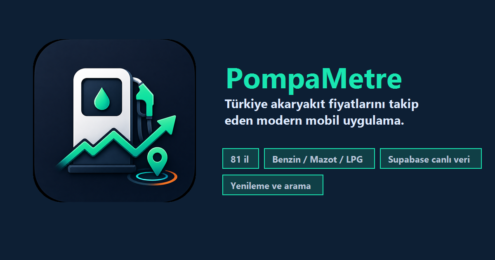

# PompaMetre



PompaMetre, Türkiye'deki akaryakıt fiyatlarını takip etmek için geliştirilen Expo + React Native mobil uygulamasıdır. Uygulama 81 il için Benzin, Mazot ve LPG fiyatlarını gösterir; şehir arama, yakıt türü filtreleme, yenileme ve fiyat geçmişi ekranlarını içerir.

## İndir

[PompaMetre APK](https://expo.dev/artifacts/eas/aNCNLkGb-n-ZDincF11sqM16xxdWXHsCkF9QooDEryI.apk)

## Özellikler

- 81 il için akaryakıt fiyat listesi
- Benzin, Mazot ve LPG arasında geçiş
- İl adına göre canlı arama
- Ana Sayfa ve İller ekranında manuel yenileme
- Supabase bağlantısı ve güvenli yedek veri kullanımı
- Fiyat geçmişi, trend grafiği ve son değişiklikler
- Brent petrol ve USD/TL bazlı Piyasa Sinyali kartı
- Bildirim ayarları ekranı
- Özel uygulama ikonu, splash screen ve README marka görseli

## Teknolojiler

- Mobile: Expo, React Native
- Navigation: React Navigation bottom tabs
- Veri tabanı: Supabase
- Backend: Python, requests, BeautifulSoup
- Otomasyon: GitHub Actions için hazır backend yapısı

## Kurulum

Mobil uygulamayı çalıştırmak için:

```bash
cd mobile
npm install
npm start
```

Backend veri çekiciyi çalıştırmak için:

```bash
cd backend
pip install -r requirements.txt
python fiyat_servisi.py
```

## Supabase

Mobil uygulama `fiyatlar` ve `gecmis` tablolarını okur. Bağlantı başarısız olursa veya tablo boşsa uygulama yerel yedek veriyle açılır; bu sayede ekranlar boş kalmaz ve uygulama crash vermez.

İsteğe bağlı ortam değişkenleri:

```bash
EXPO_PUBLIC_SUPABASE_URL=
EXPO_PUBLIC_SUPABASE_ANON_KEY=
```

Bildirimlerin canlı çalışması için `backend/supabase_notifications.sql`, Piyasa Sinyali için `backend/supabase_market_signals.sql` dosyası Supabase SQL Editor'da bir kez çalıştırılmalıdır. GitHub Actions backend akışı için `SUPABASE_URL`, `SUPABASE_KEY` ve güvenli token okuma amacıyla `SUPABASE_SERVICE_ROLE_KEY` secret olarak eklenmelidir.

## Uygulama Ekranları

- Ana Sayfa: güncel ortalama fiyatlar, piyasa sinyali, son yenileme zamanı ve 7 günlük trend
- İller: 81 il listesi, yakıt türü seçimi, il arama ve yenileme
- Geçmiş: 30 günlük trend, özet metrikler ve son değişiklikler
- Bildirimler: fiyat uyarıları, sessiz saatler ve takip edilen şehir/yakıt ayarları

## Yol Haritası

- Tamamlandı: Expo crash düzeltmeleri
- Tamamlandı: Koyu tema ve ekran tasarımları
- Tamamlandı: Supabase okuma bağlantısı
- Tamamlandı: İl arama, yakıt filtreleme ve manuel yenileme
- Tamamlandı: Logo, app icon, splash screen ve README görseli
- Tamamlandı: gerçek bildirim izinleri, token kaydı ve backend fiyat değişimi push akışı
- Tamamlandı: Brent petrol ve USD/TL bazlı Piyasa Sinyali fazı
- Sıradaki: Supabase bildirim/sinyal tablolarını ve GitHub Actions service role secret'ını üretimde aktif etmek

## Veri Kaynağı

Backend tarafı akaryakıt fiyatlarını web kaynağından çekip Supabase'e yazar. Piyasa Sinyali fazında Brent petrol için DataHub/FRED, USD/TL için TCMB günlük kur verisi kullanılır. Mobil uygulama ise Supabase'den okur ve kullanıcıya koyu temalı, mobil odaklı bir arayüzle sunar.
