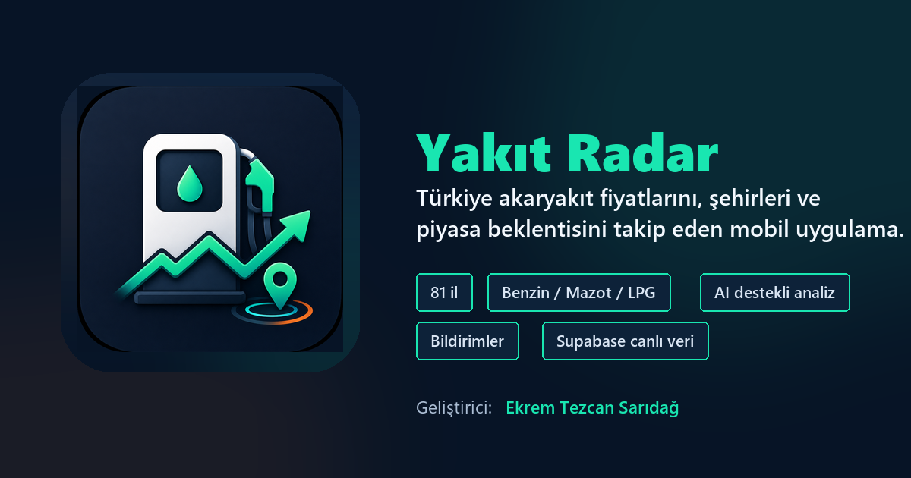

# Yakıt Radar



Yakıt Radar, Türkiye'deki akaryakıt fiyatlarını takip etmek için geliştirilen Expo + React Native mobil uygulamasıdır. Uygulama 81 il için Benzin, Mazot ve LPG fiyatlarını gösterir; şehir arama, yakıt türü filtreleme, yenileme ve fiyat geçmişi ekranlarını içerir.

## İndir

[Yakıt Radar APK](https://expo.dev/artifacts/eas/aNCNLkGb-n-ZDincF11sqM16xxdWXHsCkF9QooDEryI.apk)

## Özellikler

- 81 il için akaryakıt fiyat listesi
- Benzin, Mazot ve LPG arasında geçiş
- İl adına göre canlı arama
- Ana Sayfa ve İller ekranında manuel yenileme
- Supabase bağlantısı ve güvenli yedek veri kullanımı
- Fiyat geçmişi, trend grafiği ve son değişiklikler
- Son 24 saatin güncel haber başlıklarıyla üretilen Piyasa Sinyali kartı
- Opsiyonel Gemini destekli kısa zam/indirim beklentisi analizi
- Bildirim ayarları ekranı
- Özel uygulama ikonu, splash screen ve README marka görseli

## Teknolojiler

- Mobile: Expo, React Native
- Navigation: React Navigation bottom tabs
- Veri tabanı: Supabase
- Backend: Python, requests, BeautifulSoup
- Otomasyon: GitHub Actions için hazır backend yapısı

## Kurulum

Mobil uygulamayı çalıştırmak için:

```bash
cd mobile
npm install
npm start
```

Backend veri çekiciyi çalıştırmak için:

```bash
cd backend
pip install -r requirements.txt
python fiyat_servisi.py
```

## Supabase

Mobil uygulama `fiyatlar` ve `gecmis` tablolarını okur. Bağlantı başarısız olursa veya tablo boşsa uygulama yerel yedek veriyle açılır; bu sayede ekranlar boş kalmaz ve uygulama crash vermez.

İsteğe bağlı ortam değişkenleri:

```bash
EXPO_PUBLIC_SUPABASE_URL=
EXPO_PUBLIC_SUPABASE_ANON_KEY=
```

Bildirimlerin canlı çalışması için `backend/supabase_notifications.sql`, Piyasa Sinyali için `backend/supabase_market_signals.sql` ve gerçekleşen zam/indirim olayları için `backend/supabase_price_change_events.sql` dosyası Supabase SQL Editor'da çalıştırılmalıdır. Bildirim audit alanları güncellendiği için mevcut kurulumlarda `backend/supabase_notifications.sql` tekrar çalıştırılabilir. Haber destekli analiz alanları için mevcut kurulumlarda `backend/supabase_market_signals.sql` tekrar çalıştırılabilir. GitHub Actions backend akışı için `SUPABASE_URL`, `SUPABASE_KEY` ve güvenli token okuma amacıyla `SUPABASE_SERVICE_ROLE_KEY` secret olarak eklenmelidir.

Opsiyonel ücretsiz AI analizi için GitHub Actions secrets tarafına `GEMINI_API_KEY` eklenebilir. `GEMINI_MODEL` verilmezse backend `gemini-2.5-flash` modelini kullanır; anahtar yoksa sistem kural tabanlı analizle çalışmaya devam eder.

Piyasa sinyali sosyal medya kaynaklarını filtreler, yalnızca son 24 saatteki başlıkları dikkate alır ve soru formatındaki haberleri düşük ağırlıklandırır. Pompa zam/indirim değişimleri bildirimler için korunur; beklenti yönünü etkilemez.

## Uygulama Ekranları

- Ana Sayfa: güncel ortalama fiyatlar, haber destekli piyasa sinyali, son yenileme zamanı ve 7 günlük trend
- İller: 81 il listesi, yakıt türü seçimi, il arama ve yenileme
- Geçmiş: 7/30/90 gün veya tüm kayıtlar için trend, özet metrikler ve gerçekleşen son değişiklikler
- Bildirimler: fiyat uyarıları, sessiz saatler ve takip edilen şehir/yakıt ayarları

## Yol Haritası

- Tamamlandı: Expo crash düzeltmeleri
- Tamamlandı: Koyu tema ve ekran tasarımları
- Tamamlandı: Supabase okuma bağlantısı
- Tamamlandı: İl arama, yakıt filtreleme ve manuel yenileme
- Tamamlandı: Logo, app icon, splash screen ve README görseli
- Tamamlandı: gerçek bildirim izinleri, token kaydı ve backend fiyat değişimi push akışı
- Tamamlandı: son 24 saatlik haberlere dayalı zam/indirim beklentisi analiz fazı
- Sıradaki: bildirim sonuçlarını yönetim/debug ekranında görünür kılmak

## Veri Kaynağı

Backend tarafı akaryakıt fiyatlarını web kaynağından çekip Supabase'e yazar. Piyasa Sinyali son 24 saatteki güncel haber başlıklarıyla üretilir; Gemini anahtarı varsa yalnızca bu başlıkları kısa bir beklenti analizine dönüştürür, anahtar yoksa kural tabanlı analiz üretilir. Mobil uygulama ise Supabase'den okur ve kullanıcıya koyu temalı, mobil odaklı bir arayüzle sunar.
